### Introduction

Teachers Credit Union (TCU) is committed to being the best in-store member experience it can be, and it starts with the logistics of providing enough cash. Too much cash for a branch will exceed the cash limit, but too little cash will incur additonal cost for TCU to make emergency orders. The old method of handling this is by team members viewing how much cash is on hand, comparing that to last year's usage in the current time frame, and estimating the need for the next week. However this naive seasonal estimation based on past year cannot take into consideration the yearly changes and has been made even harder due to covid situation. It is time now to build a better time series model to forecast the daily cash use by branches.

### Data

We used daily cash use data of 49 branches at TCU from Jan 1, 2010 to July 31, 2020. It is a time series data of daily cash use with 171230 observations. Aside from daily cash use, it also includes variables such as holidays, cash order received per week, cash balance start of the day, etc.

<table class="tableizer-table">
<thead><tr class="tableizer-firstrow"><th></th></tr></thead><tbody>
 <tr><td></td><td>BranchID</td><td>CashOrdersReceived</td><td>CashBalance_StartOfDay</td><td>TotalCashUsed</td><td>CashToVault</td><td>CashUnder</td><td>CashOver</td><td>TotalCashDisbursed</td><td>TotalCashOpeningBalance</td><td>TotalCashReceivedAllSources</td><td>HolidayDate</td><td>Holiday</td><td>before</td><td>before_holiday</td><td>after</td><td>after_holiday</td><td>Year</td><td>Month</td><td>Day_name</td></tr>
 <tr><td>BusinessDate</td><td>&nbsp;</td><td>&nbsp;</td><td>&nbsp;</td><td>&nbsp;</td><td>&nbsp;</td><td>&nbsp;</td><td>&nbsp;</td><td>&nbsp;</td><td>&nbsp;</td><td>&nbsp;</td><td>&nbsp;</td><td>&nbsp;</td><td>&nbsp;</td><td>&nbsp;</td><td>&nbsp;</td><td>&nbsp;</td><td>&nbsp;</td><td>&nbsp;</td><td>&nbsp;</td></tr>
 <tr><td>2010-01-01</td><td>99</td><td>nan</td><td>1195235.33</td><td>48082.66</td><td>nan</td><td>nan</td><td>nan</td><td>nan</td><td>1195235.33</td><td>nan</td><td>2010-01-01</td><td>New Year's Day</td><td>NaN</td><td>NaN</td><td>NaN</td><td>NaN</td><td>2010</td><td>1</td><td>Friday</td></tr>
 <tr><td>2010-01-02</td><td>99</td><td>nan</td><td>1147152.68</td><td>nan</td><td>nan</td><td>nan</td><td>nan</td><td>nan</td><td>1147152.68</td><td>nan</td><td>NaN</td><td>NaN</td><td>NaN</td><td>NaN</td><td>2010-01-02</td><td>New Year's Day_After</td><td>2010</td><td>1</td><td>Saturday</td></tr>
 <tr><td>2010-01-03</td><td>99</td><td>nan</td><td>1147152.68</td><td>92262.26</td><td>nan</td><td>nan</td><td>nan</td><td>nan</td><td>1147152.68</td><td>nan</td><td>NaN</td><td>NaN</td><td>NaN</td><td>NaN</td><td>NaN</td><td>NaN</td><td>2010</td><td>1</td><td>Sunday</td></tr>
 <tr><td>2010-01-04</td><td>99</td><td>nan</td><td>1054890.42</td><td>64107.06</td><td>nan</td><td>nan</td><td>nan</td><td>nan</td><td>1054890.42</td><td>nan</td><td>NaN</td><td>NaN</td><td>NaN</td><td>NaN</td><td>NaN</td><td>NaN</td><td>2010</td><td>1</td><td>Monday</td></tr>
 <tr><td>2010-01-05</td><td>99</td><td>nan</td><td>990783.35</td><td>12372.77</td><td>nan</td><td>nan</td><td>nan</td><td>nan</td><td>990783.35</td><td>nan</td><td>NaN</td><td>NaN</td><td>NaN</td><td>NaN</td><td>NaN</td><td>NaN</td><td>2010</td><td>1</td><td>Tuesday</td></tr>
 <tr><td>...</td><td>...</td><td>...</td><td>...</td><td>...</td><td>...</td><td>...</td><td>...</td><td>...</td><td>...</td><td>...</td><td>...</td><td>...</td><td>...</td><td>...</td><td>...</td><td>...</td><td>...</td><td>...</td><td>...</td></tr>
 <tr><td>2020-07-27</td><td>501</td><td>nan</td><td>1174197.12</td><td>18095.32</td><td>nan</td><td>nan</td><td>nan</td><td>nan</td><td>1174197.12</td><td>nan</td><td>NaN</td><td>NaN</td><td>NaN</td><td>NaN</td><td>NaN</td><td>NaN</td><td>2020</td><td>7</td><td>Monday</td></tr>
 <tr><td>2020-07-28</td><td>501</td><td>nan</td><td>1156101.79</td><td>161573.86</td><td>nan</td><td>nan</td><td>nan</td><td>nan</td><td>1156101.79</td><td>nan</td><td>NaN</td><td>NaN</td><td>NaN</td><td>NaN</td><td>NaN</td><td>NaN</td><td>2020</td><td>7</td><td>Tuesday</td></tr>
 <tr><td>2020-07-29</td><td>501</td><td>440550.11</td><td>1435078.04</td><td>66574.28</td><td>nan</td><td>nan</td><td>nan</td><td>nan</td><td>1435078.04</td><td>nan</td><td>NaN</td><td>NaN</td><td>NaN</td><td>NaN</td><td>NaN</td><td>NaN</td><td>2020</td><td>7</td><td>Wednesday</td></tr>
 <tr><td>2020-07-30</td><td>501</td><td>nan</td><td>1368503.76</td><td>227236.55</td><td>nan</td><td>nan</td><td>nan</td><td>nan</td><td>1368503.76</td><td>nan</td><td>NaN</td><td>NaN</td><td>NaN</td><td>NaN</td><td>NaN</td><td>NaN</td><td>2020</td><td>7</td><td>Thursday</td></tr>
 <tr><td>2020-07-31</td><td>501</td><td>nan</td><td>1141267.21</td><td>55886.53</td><td>nan</td><td>600.15</td><td>nan</td><td>816941.38</td><td>1314870.56</td><td>643938.18</td><td>NaN</td><td>NaN</td><td>NaN</td><td>NaN</td><td>NaN</td><td>NaN</td><td>2020</td><td>7</td><td>Friday</td></tr>
 <tr></tr>
</tbody></table>
<td>171230 rows × 19 columns</td>


### EDA

#### Daily cash use by branches
 
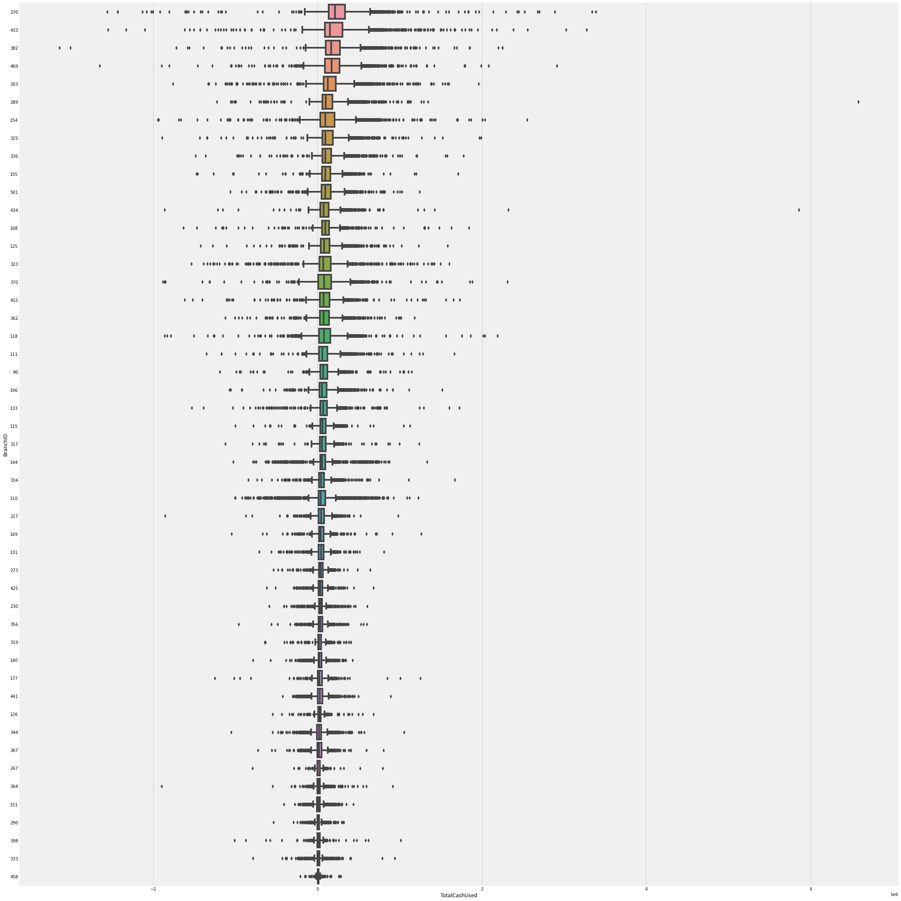
 
We can see that the distribution of daily cash usage by branches have a lot of outliers for each branch. 

#### Average daily cash use by branches

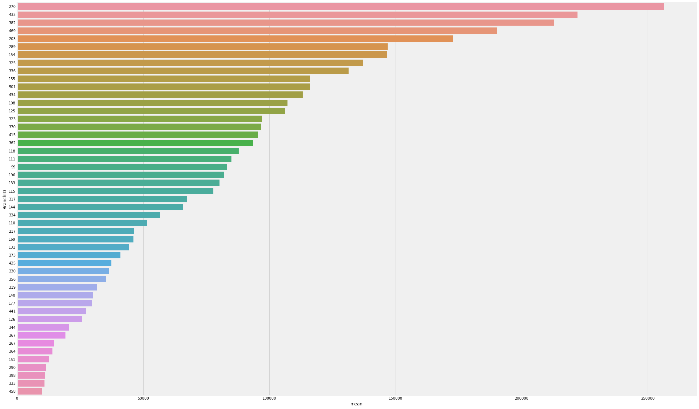

We can see that branches vary a lot in terms of average daily cash usage. The largest branch has an average daily cash usage of $256,456, while the smallest branch has an average daily cash usage of $9,957. 
 

#### Compare two branches

##### Branch 270

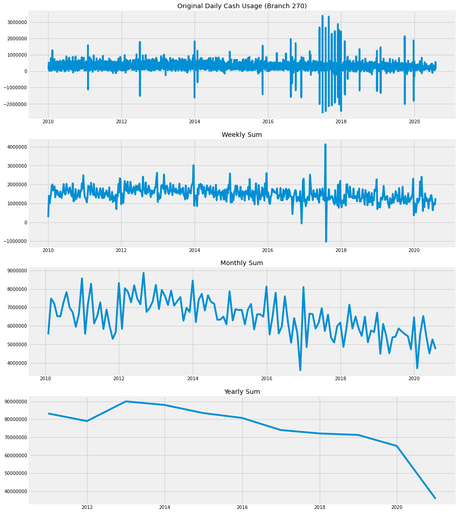

##### Branch 398

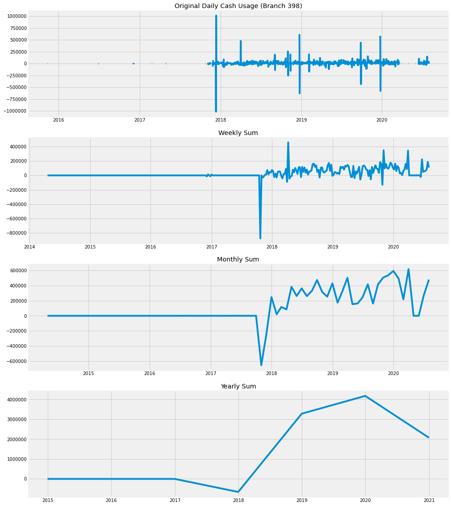

The comparison between two branches further elaborate on the differences among branches. These differences suggest that we may need to build different models for different branches.

**Initial EDA confirms on two main points:**
1. Big differences by branch
2. Naive seaonal prediction based on last year's data at the same time cannot capture the changes in the new year, especially during the COVID

#### Closing dates for branches

##### Closing days of week

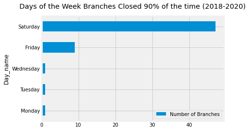

Most of the branches will close on Saturdays. 

##### Closing holidays

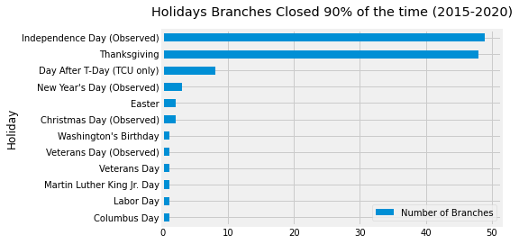

Most of the branches will close on Independence Day and Thanksgiving. 

### Modeling

#### Fit one branch

#### Branch=270

#### Seasonal Naive -- Benchmark

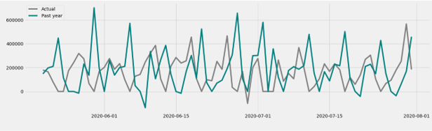

This is the traditional way used by TCU to predict the cash usage. 

#### ARIMA and SARIMA Models

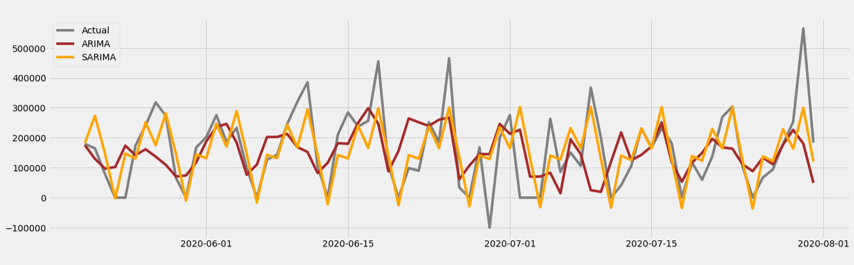

This graph compares the results of ARIMA(6, 1, 0) and Seasonal ARIMA(6,1,0)(0,1,2)[7] models. 


##### Prophet Model

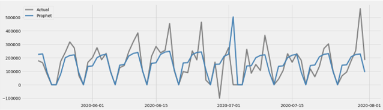

This graph shows the result of prophet model. 

##### Model Selection 

###### SMAPE (Symetric Mean Absolute Percentage Error)
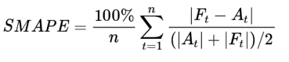
This is the main metric the client used to test the model.

+ Seasonal Naive SMAPE=107.52
+ ARIMA SMAPE=75.09
+ SARIMA SMAPE=65.83
+ SMAPE=34.56

###### Final selection - Prophet Model

+ Accurate and fast  
+ Fully automatic: robust to outliers, missing data, and dramatic changes in time series.
+ Tunable forecasts: human-interpretable parameters, adding domain knowledge.

##### Prophet forecast

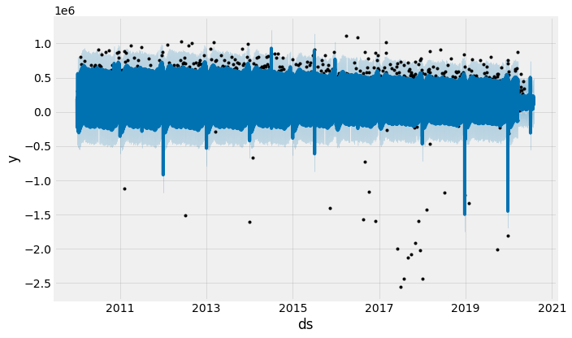

This graph shows the forecast result for the prophet model. Blue lines indicate the forcast values, black dots indicate the actual values

##### Prophet component

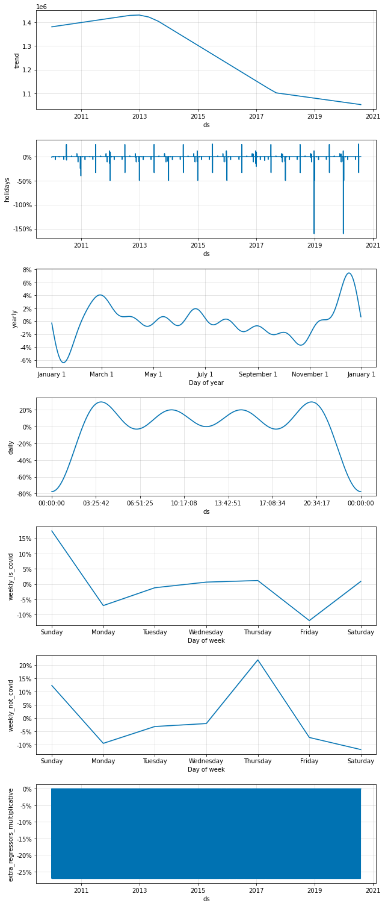

This graph shows the components of prophet model, including the trend, holiday effect, yearly, daily, weekly seasonality. 
It is worth noticing that daily cash usage during the covid is more spread out over a week while daily cash usage before the covid tend to cluster on one day.

##### Model Tuning
###### Hyperparameters for tuning:
+ changepoint_prior_scale [0.001, 0.5]: flexibility of the trend. Small – less flexible
+ seasonality_prior_scale [0.01, 10]: flexibility of the seasonality.
+ holidays_prior_scale [0.01, 10]: flexibility to fit holiday effects. 
+ seasonality_mode: Options are 'additive’ and 'multiplicative'. 

There are 49 branches, we looped through all branches and calculate the SMAPE for each branch. Then selected branches with high SMAPE to retune the model. Here is an example of code: 

```
param_grid = {
'changepoint_prior_scale': [0.01, 0.05, 0.1, 0.5], 'seasonality_prior_scale': [0.01, 0.1, 1.0, 10.0], 'holidays_prior_scale': [0.1, 1.0, 10.0, 20],

}

##Generate all combinations of parameters¶
all_params = [dict(zip(param_grid.keys(), v)) for v in itertools.product(*param_grid.values())] smape_values = [] # Store the smapes for each params here

for params in all_params:

m = Prophet(holidays=holiday, yearly_seasonality=True, weekly_seasonality=False,  daily_seasonality=True, seasonality_mode='multiplicative', 
       **params)
m.add_seasonality(name='weekly_is_covid', period=7, fourier_order=3, condition_name='is_covid')
m.add_seasonality(name='weekly_not_covid', period=7, fourier_order=3, condition_name='not_covid')
#m.add_regressor('is_weekends')

m.fit(train_ts)  # Fit model with given params
cutoffs = pd.to_datetime(['2019-12-01', '2020-03-01','2020-04-01', '2020-05-01'])
df_cv = cross_validation(m, cutoffs=cutoffs, horizon='120 days', period='7 days', parallel="processes")
a = df_cv['y']
f = df_cv['yhat']
smape_value = smape(a, f)
smape_values.append(smape_value)
```


###### Results
+ Overall Prophet model SMAPE on test data: 59.71%. 
+ Overall Seasonal Naïve method SMAPE on test data: 141.26%.
+ Improved performance: (141.26%-59.71%)/141.26% = 57.73%.
+ SMAPE on forecast data: 74.89%, ranked 1st out of 29 teams.
+ Built an Streamlit app to deploy prophet model.


