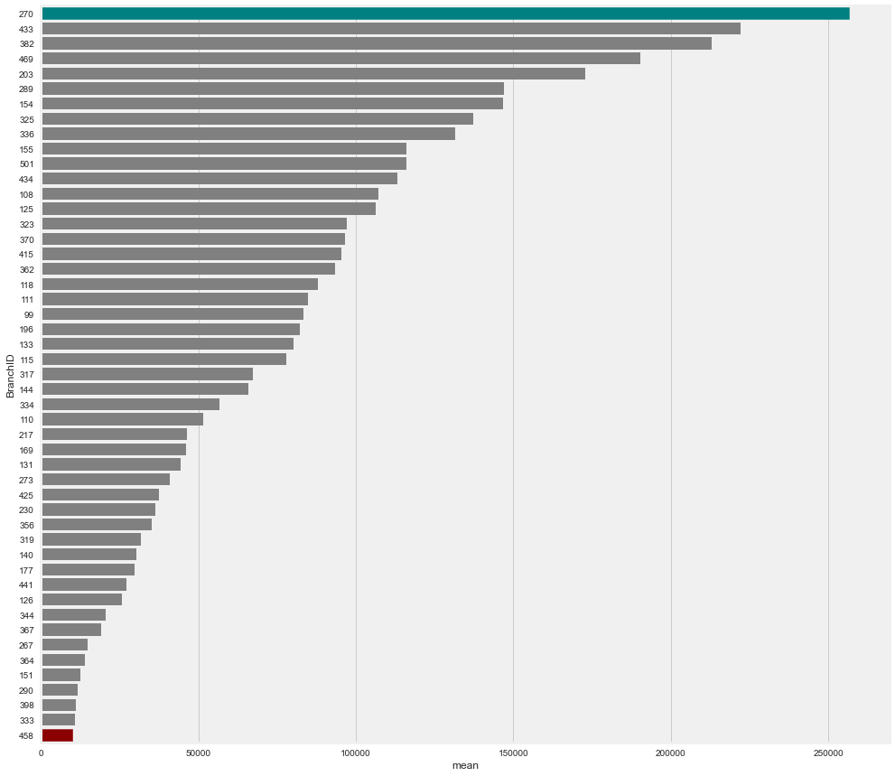
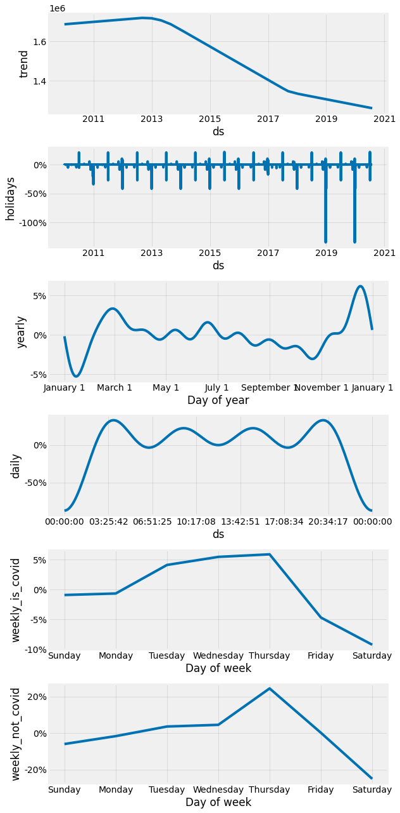

### Introduction

Teachers Credit Union (TCU) is committed to being the best in-store member experience it can be, and it starts with the logistics of providing enough cash. Too much cash for a branch will exceed the cash limit, but too little cash will incur additonal cost for TCU to make emergency orders. The old method of handling this is by team members viewing how much cash is on hand, comparing that to last year's usage in the current time frame, and estimating the need for the next week. However this naive seasonal estimation based on past year cannot take into consideration the yearly changes and has been made even harder due to covid situation. It is time now to build a better time series model to forecast the daily cash use by branches.

### Data

We used daily cash use data of 49 branches at TCU from Jan 1, 2010 to July 31, 2020. It is a time series data of daily cash use with 171230 observations. Aside from daily cash use, it also includes variables such as holidays, cash order received per week, cash balance start of the day, etc.

### EDA

#### Daily cash use by branches
 

#### Average daily cash use by branches

#### Compare two branches

##### Branch 270

##### Branch 398

**Initial EDA confirms on two main points:**
1. Big differences by branch
2. Naive seaonal prediction based on last year's data at the same time cannot capture the changes in the new year, especially during the COVID

#### Closing dates for branches

##### Closing days of week

##### Closing holidays

### Modeling

#### Fit one branch

#### Branch=270

##### Prophet forecast

##### Prophet component

##### Prediction comparison

